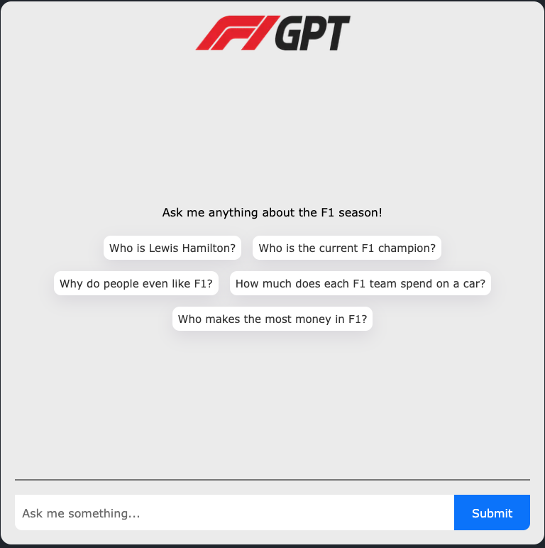

# F1GPT

A chatbot for F1 enthusiasts.

This is a small personal project built to learn how to use open source tools to build a chatbot.

It ensures that latest F1 data is used by scraping the latest data from the internet and storing it in a vector database.

For example, if you ask it about current F1 champions, it will use the latest data from the internet to answer you and is not limited by the training data of the model.

## Features

- Chat with a chatbot that knows everything about F1
- Uses up to date data from the internet

## Tech Stack

- Uses the OpenRouter API and DeepSeek Chat model
- Uses Sentence Transformers for embeddings
- Uses Astra DB for vector database
- Uses Vercel AI SDK to build the chatbot
- Deployed on Vercel, right [here](https://f1-gpt-two.vercel.app/)

